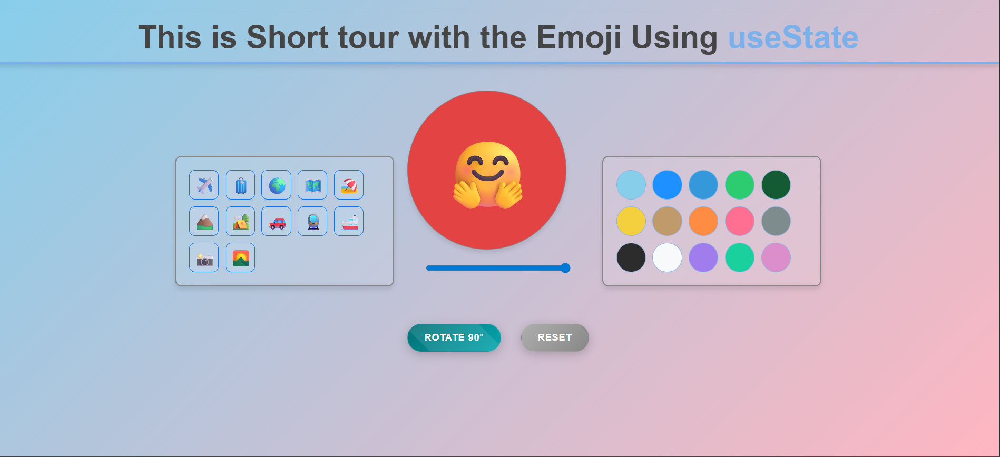

# Hooks

  

Hooks is a simple React application that demonstrates the use of the useState hook. It allows users to interact with different emojis, change their size, and rotate them.

# Hosted Link

https://emojiedit.netlify.app/

## Installation

To run this project locally, follow these steps:

1. Clone the repository: `git clone https://github.com/your-username/hooks.git`
2. Navigate to the project directory: `cd hooks`
3. Install the dependencies: `npm install`
4. Start the development server: `npm run dev`

## Usage

1. Click on any of the emojis in the left panel to select it.
2. Use the size slider in the center to adjust the size of the selected emoji.
3. Click on any of the color buttons in the right panel to change the background color of the selected emoji.
4. Click on the "Rotate 90°" button to rotate the selected emoji by 90 degrees.
